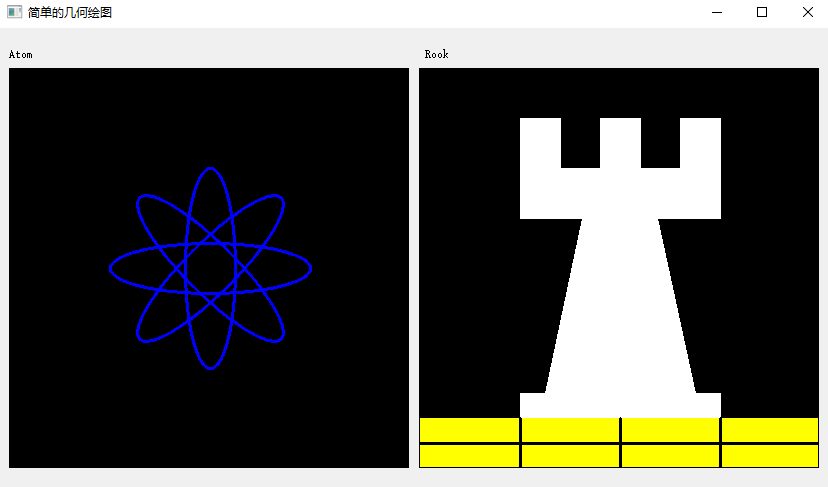

<!--
 * @Date: 2020-08-20 15:11:07
 * @LastEditTime: 2020-08-20 15:36:44
 * @Author:  Chang_Bin
 * @LastEditors: Chang_Bin
 * @Email: bin_chang@qq.com
 * @Description: In User Settings Edit
-->
# 基础绘图

## 目标
在本教程中，您将学习到：
* 使用OpenCV函数[line()](https://docs.opencv.org/4.3.0/d6/d6e/group__imgproc__draw.html#ga7078a9fae8c7e7d13d24dac2520ae4a2)画一条**线**
* 使用OpenCV函数[ellipse()](https://docs.opencv.org/4.3.0/d6/d6e/group__imgproc__draw.html#ga28b2267d35786f5f890ca167236cbc69)绘制一个**椭圆**
* 使用OpenCV函数[rectangle()](https://docs.opencv.org/4.3.0/d6/d6e/group__imgproc__draw.html#ga07d2f74cadcf8e305e810ce8eed13bc9)绘制**矩形**
* 使用OpenCV函数[circle()](https://docs.opencv.org/4.3.0/d9/db7/group__datasets__gr.html#gga610754124ced68d1f05760b5948fbb76a6f0d8b2d9e3e947b2a5c1eff9e81ee95)画一个**圆**
* 使用OpenCV函数[fillPoly()](https://docs.opencv.org/4.3.0/d6/d6e/group__imgproc__draw.html#ga8c69b68fab5f25e2223b6496aa60dad5)绘制一个填充的多边形

## OpenCV理论

在本教程中，我们将重点使用两种结构：[cv::Point](https://docs.opencv.org/4.3.0/dc/d84/group__core__basic.html#ga1e83eafb2d26b3c93f09e8338bcab192)和[cv::Scalar](https://docs.opencv.org/4.3.0/dc/d84/group__core__basic.html#ga599fe92e910c027be274233eccad7beb)：

### Point
它代表一个2D点，​​由其图像坐标x和y指定。我们可以将其定义为：

```
Point pt;
pt.x = 10;
pt.y = 8;
```
或者
```
Point pt =  Point(10, 8);
```

### Scalar

* 表示4元素向量。标量类型在OpenCV中广泛用于传递像素值。
* 在本教程中，我们将广泛使用它来表示BGR颜色值（3个参数）。如果不使用最后一个参数，则无需定义。
* 让我们看一个例子，如果要求我们提供颜色参数，然后给出
```
Scalar( a, b, c )
```
我们将定义BGR颜色，例如：蓝色= a，绿色= b,红色= c

## 代码解释

由于我们计划绘制两个示例（一个原子和一个rook），因此我们必须创建两个图像和两个窗口来显示它们。

```
  Mat atom_image = Mat::zeros( w, w, CV_8UC3 );
  Mat rook_image = Mat::zeros( w, w, CV_8UC3 );
```

我们创建了绘制不同几何形状的函数。例如，要绘制原子，我们使用了MyEllipse和MyFilledCircle：
```
  MyEllipse( atom_image, 90 );
  MyEllipse( atom_image, 0 );
  MyEllipse( atom_image, 45 );
  MyEllipse( atom_image, -45 );
  MyFilledCircle( atom_image, Point( w/2, w/2) );
```
为了绘制rook，我们使用了MyLine，矩形和MyPolygon：
```
  MyPolygon( rook_image );
  rectangle( rook_image,
         Point( 0, 7*w/8 ),
         Point( w, w),
         Scalar( 0, 255, 255 ),
         FILLED,
         LINE_8 );
  MyLine( rook_image, Point( 0, 15*w/16 ), Point( w, 15*w/16 ) );
  MyLine( rook_image, Point( w/4, 7*w/8 ), Point( w/4, w ) );
  MyLine( rook_image, Point( w/2, 7*w/8 ), Point( w/2, w ) );
  MyLine( rook_image, Point( 3*w/4, 7*w/8 ), Point( 3*w/4, w ) );
```
让我们看一下每个函数的内部内容：
### MyLine
```
void MyLine( Mat img, Point start, Point end )
{
  int thickness = 2;
  int lineType = LINE_8;
  line( img,
    start,
    end,
    Scalar( 0, 0, 0 ),
    thickness,
    lineType );
}
```
* 如我们所见，MyLine只是调用函数line()，它执行以下操作：
  * 从start到end画一条线
  * 该线显示在图像img中
  * 线条颜色由（0，0，0）定义，它是对应于Black的RGB值
  * 线的粗细设置为thickness（在这种情况下为2）
  * 这条线类型是8（lineType=8）

### MyEllipse

```
void MyEllipse( Mat img, double angle )
{
  int thickness = 2;
  int lineType = 8;
  ellipse( img,
       Point( w/2, w/2 ),
       Size( w/4, w/16 ),
       angle,
       0,
       360,
       Scalar( 255, 0, 0 ),
       thickness,
       lineType );
}
```
* 从上面的代码中，我们可以观察到函数ellipse（）绘制了一个椭圆：
  * 椭圆显示在图像img中
  * 椭圆中心位于点（w / 2，w / 2）中，并封闭在大小为（w / 4，w / 16）的区域中
  * 椭圆旋转angle度
  * 椭圆在0到360度之间延伸圆弧
  * 图的颜色将是（255，0，0），这意味着BGR值是蓝色的。
  * 椭圆线的粗细为2。


剩下的函数大家可以自己去官网查看，官网在介绍每个参数的含义。

## 结果

编译并运行程序将为您提供如下结果(结果中我少画了一个原子的中心)：

<div align="center">

</div>