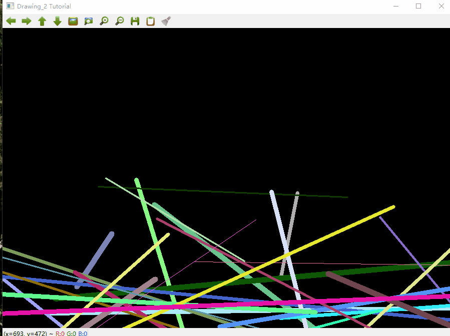

# OpenCV的随机生成器和文本
## 目的
在本教程中，您将学习到：
* 使用随机数生成器类（[cv::RNG](https://docs.opencv.org/4.3.0/d1/dd6/classcv_1_1RNG.html)）以及如何从均匀分布中获取随机数;
* 通过使用函数[cv::putText](https://docs.opencv.org/4.3.0/d6/d6e/group__imgproc__draw.html#ga5126f47f883d730f633d74f07456c576)在OpenCV窗口上显示文本

## 代码解释

1. 让我们从drawAllImgs()函数开始。我们观察到，我们要做的第一件事是创建一个随机数生成器对象（RNG）：
```
RNG rng( 0xFFFFFFFF );
```
RNG实现了一个随机数生成器。在此示例中，rng是使用值0xFFFFFFFF初始化的RNG元素
2. 然后，我们创建一个初始化为零的矩阵（这意味着它将显示为黑色），并指定其高度，宽度和类型:
   ```
   Mat image = Mat::zeros( window_height, window_width, CV_8UC3 );
    imshow( window_name, image );
   ```
3. 然后我们继续画有趣的东西。看完代码后，您可以看到它主要分为8个部分，定义为函数
```
   c = Drawing_Random_Lines(image, window_name, rng);
if( c != 0 ) return 0;
c = Drawing_Random_Rectangles(image, window_name, rng);
if( c != 0 ) return 0;
c = Drawing_Random_Ellipses( image, window_name, rng );
if( c != 0 ) return 0;
c = Drawing_Random_Polylines( image, window_name, rng );
if( c != 0 ) return 0;
c = Drawing_Random_Filled_Polygons( image, window_name, rng );
if( c != 0 ) return 0;
c = Drawing_Random_Circles( image, window_name, rng );
if( c != 0 ) return 0;
c = Displaying_Random_Text( image, window_name, rng );
if( c != 0 ) return 0;
c = Displaying_Big_End( image, window_name, rng );
```
所有这些功能都遵循相同的模式，因此我们将仅分析其中的几个，因为相同的解释适用于所有功能。

4. 分析函数Drawing_Random_Lines():
```
int Drawing_Random_Lines( Mat image, char* window_name, RNG rng )
{
  int lineType = 8;
  Point pt1, pt2;
  for( int i = 0; i < NUMBER; i++ )
  {
   pt1.x = rng.uniform( x_1, x_2 );
   pt1.y = rng.uniform( y_1, y_2 );
   pt2.x = rng.uniform( x_1, x_2 );
   pt2.y = rng.uniform( y_1, y_2 );
   line( image, pt1, pt2, randomColor(rng), rng.uniform(1, 10), 8 );
   imshow( window_name, image );
   if( waitKey( DELAY ) >= 0 )
   { return -1; }
  }
  return 0;
}
```
我们可以观察到以下内容：

   * for循环将重复NUMBER次。由于函数cv :: line在此循环内，因此将生成NUMBER行
   * 线极限由pt1和pt2给出。对于pt1，我们可以看到
```
pt1.x = rng.uniform( x_1, x_2 );
pt1.y = rng.uniform( y_1, y_2 );
```
* 
  * 我们知道rng是一个随机数生成器对象。在上面的代码中，我们调用rng.uniform（a，b）。这将在值a和b（包含a,b端点）之间生成随机统一的分布。
  * 根据上面的解释，我们推断出极值pt1和pt2将是随机值，因此线条的位置将非常不可预测，从而提供良好的视觉效果（请查看下面的“结果”部分）。
  * 我们注意到在cv :: line参数中，对于颜色输入，我们输入:
    ```
    randomColor(rng)
    ```
    让我们看一下该函数的实现：
    ```
    static Scalar randomColor( RNG& rng )
    {
        int icolor = (unsigned) rng;
        return Scalar( icolor&255, (icolor>>8)&255, (icolor>>16)&255 );
    }
    ```
    返回值是一个标量，具有3个随机初始化的值，这些值用作线条颜色的R，G和B参数。因此，线条的颜色也是随机的！
5. 上面的说明适用于生成圆，椭圆，多边形等的其他函数。诸如中心和顶点的参数也是随机生成的。
6. 在结束之前，我们还应该看一下Display_Random_Text和Displaying_Big_End函数，因为它们都有一些有趣的功能：
7. Display_Random_Text:
   ```
   int Displaying_Random_Text( Mat image, char* window_name, RNG rng )
    {
        int lineType = 8;
        for ( int i = 1; i < NUMBER; i++ )
        {
        Point org;
        org.x = rng.uniform(x_1, x_2);
        org.y = rng.uniform(y_1, y_2);
        putText( image, "Testing text rendering", org, rng.uniform(0,8),
             rng.uniform(0,100)*0.05+0.1, randomColor(rng), rng.uniform(1, 10), lineType);
        imshow( window_name, image );
        if( waitKey(DELAY) >= 0 )
        { return -1; }
    }
    return 0;
    }
   ```
   一切看起来都很熟悉，但表达如下：
   ```
   putText( image, "Testing text rendering", org, rng.uniform(0,8),
         rng.uniform(0,100)*0.05+0.1, randomColor(rng), rng.uniform(1, 10), lineType);
   ```
   因此，该函数的主要功能如下:
   * 在图像中绘制文本“测试文本渲染” **
   * 文本的左下角将位于org点处
   * 字体类型是一个随机整数值，范围为[0,8)。
   * 字体的大小由表达式rng.uniform（0，100）x0.05 + 0.1表示（表示其范围是：[0.1,5.1)）
   * 文字颜色是随机的（由randomColor（rng）表示）
   * 文字的粗细范围介于1到10之间，由rng.uniform（1,10）指定
结果，我们将在图像上的任意位置（类似于其他绘图功能）获得NUMBER个文本。

8. Displaying_Big_End
```
int Displaying_Big_End( Mat image, char* window_name, RNG rng )
{
  Size textsize = getTextSize("OpenCV forever!", FONT_HERSHEY_COMPLEX, 3, 5, 0);
  Point org((window_width - textsize.width)/2, (window_height - textsize.height)/2);
  int lineType = 8;
  Mat image2;
  for( int i = 0; i < 255; i += 2 )
  {
    image2 = image - Scalar::all(i);
    putText( image2, "OpenCV forever!", org, FONT_HERSHEY_COMPLEX, 3,
           Scalar(i, i, 255), 5, lineType );
    imshow( window_name, image2 );
    if( waitKey(DELAY) >= 0 )
      { return -1; }
  }
  return 0;
}
```

除了函数getTextSize（获取参数文本的大小）外，我们可以观察到的新操作位于for循环内：

```
image2 = image - Scalar::all(i)
```

因此，image2是image和Scalar::all（i）的减法。实际上，这里发生的是image2的每个像素都是图像的每个像素减去i的值的结果（请记住，对于每个像素，我们正在考虑三个值，例如R，G和B，因此每个将受到影响）

还要记住，减法运算始终在内部执行饱和运算，这意味着所获得的结果将始终在允许的范围内（对于我们的示例，该结果不得为负且在0到255之间）。

## 结果

在QT窗口中暂时没有实现显示动画的功能，opencv的窗口中显示的结果如下:

<div align="center">

</div>