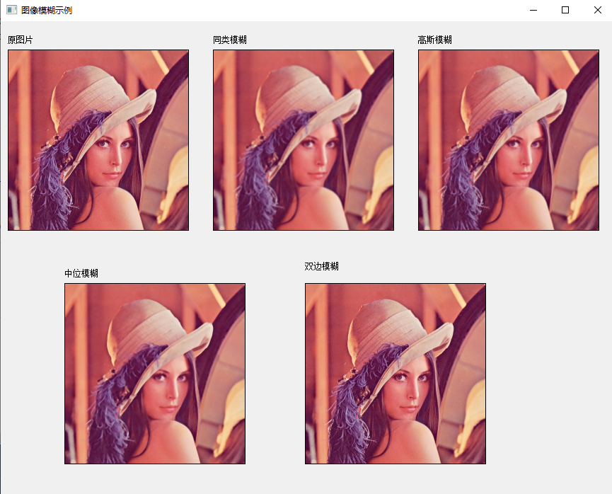

<!--
 * @Date: 2020-08-22 17:57:30
 * @LastEditTime: 2020-08-23 11:10:06
 * @Author:  Chang_Bin
 * @LastEditors: Chang_Bin
 * @Email: bin_chang@qq.com
 * @Description: In User Settings Edit
-->
# 图像模糊操作
## 目标
在本教程中，您将学习如何使用OpenCV函数将各种线性滤波器应用于平滑图像，例如:

* [blur()](https://docs.opencv.org/4.3.0/d4/d86/group__imgproc__filter.html#ga8c45db9afe636703801b0b2e440fce37)
* [GaussianBlur()](https://docs.opencv.org/4.3.0/d4/d86/group__imgproc__filter.html#gaabe8c836e97159a9193fb0b11ac52cf1)
* [medianBlur()](https://docs.opencv.org/4.3.0/d4/d86/group__imgproc__filter.html#ga564869aa33e58769b4469101aac458f9)
* [bilateralFilter()](https://docs.opencv.org/4.3.0/d4/d86/group__imgproc__filter.html#ga9d7064d478c95d60003cf839430737ed)

## 理论

--------------------------------
Note:

以下说明属于Richard Szeliski撰写的《计算机视觉：算法和应用》一书，以及LearningOpenCV:

--------------------------------
* 平滑（也称为模糊）是一种简单且经常使用的图像处理操作。
* 进行平滑处理的原因很多。在本教程中，我们将专注于平滑以减少噪声（其他用途将在以下教程中看到）。
* 为了执行平滑操作，我们将对图像应用滤波器。最常见的滤波器类型是线性的，其中将输出像素值（即）确定为输入像素值的加权和(即)：
<div align="center">

</div>

称为核，这不过是滤波器的系数而已。

它有助于将滤波器可视化为系数窗口在图像上滑动。

* 过滤器有很多种，在这里我们将提到最常用的过滤器：
### 归一化块式过滤器
* 这个过滤器是最简单的！每个输出像素都是其内核邻居的平均值（所有像素的权重均相等）
* 内核如下：
<div align="center">

</div>

### 高斯滤波器
* 可能是最有用的过滤器（尽管不是最快的）。高斯滤波是通过将输入数组中的每个点与高斯内核进行卷积，然后将它们全部求和以生成输出数组来完成的。
* 为了使画面更清晰。
  
<div align="center">

</div>

假设图像是一维的，则可以注意到位于中间的像素的权重最大。随着邻居和中心像素之间空间距离的增加，邻居的权重减小。

------------------------------------------
Note

二维高斯可以表示为：

<div align="center">

</div>

其中μ是平均值（峰值），而表示方差（每个变量x和y）

### 中值过滤器

中值滤波器遍历信号的每个元素（在本例中为图像），并用其相邻像素（位于评估像素周围的正方形邻域）的中值替换每个像素。

### 双边过滤器

* 到目前为止，我们已经解释了一些过滤器，其主要目标是使输入图像平滑。但是，有时滤波器不仅可以消除噪音，还可以平滑边缘。为了避免这种情况（至少在一定程度上），我们可以使用双边过滤器。
* 以与高斯滤波器类似的方式，双边滤波器还考虑了分配有权重的相邻像素。这些权重包含两个分量，第一个分量与高斯滤波器使用的权重相同。第二部分考虑了相邻像素和评估像素之间的强度差异。
* 有关更详细的说明，可以点击此[链接](http://homepages.inf.ed.ac.uk/rbf/CVonline/LOCAL_COPIES/MANDUCHI1/Bilateral_Filtering.html)

## 代码说明

让我们检查仅涉及平滑过程的OpenCV函数，因为其余的函数现在已经知道。

### 归一化块过滤器：

* OpenCV提供[blur()](https://docs.opencv.org/4.3.0/d4/d86/group__imgproc__filter.html#ga8c45db9afe636703801b0b2e440fce37)函数来使用此过滤器进行平滑处理。我们指定4个参数：
  * srcImg:源图像
  * dstImg: 目标图像
  * Size(w,h): 定义要使用的（宽度w像素和高度h像素的）内核大小
  * Point(-1,-1):指示锚点（评估的像素）相对于邻域的位置。如果存在负值，则将内核中心视为锚点。
    ```
    cv::blur(srcImg, dstImg, cv::Size(5, 5));
    ```
### 高斯滤波器：
* 它由函数[GaussianBlur()](https://docs.opencv.org/4.3.0/d4/d86/group__imgproc__filter.html#gaabe8c836e97159a9193fb0b11ac52cf1)执行：这里我们使用4个参数
  * srcImg:源图像
  * dstImg: 目标图像
  * Size(w,h): 要使用的内核的大小（要考虑的临近像素）。w和h必须为奇数和正数，否则将使用和参数计算大小。
  * : y的标准偏差。写入0表示使用内核大小来计算。
  
  ```
      cv::GaussianBlur(srcImg, dstImg, cv::Size(5, 5),0,0);
  ```
  
### 中值过滤器：
* 该过滤器由[meanBlur()](https://docs.opencv.org/4.3.0/d4/d86/group__imgproc__filter.html#ga564869aa33e58769b4469101aac458f9)函数提供：我们使用三个参数:
  * srcImg:源图像
  * dstImg: 目标图像,必须与src类型相同
  * i: 内核的大小（因为使用方形窗口，所以只有一个）。必须是奇数。
```
cv::medianBlur(srcImg, dstImg, 5);
```

### 双边过滤器
* 由OpenCV函数提供的[bilateralFilter()](https://docs.opencv.org/4.3.0/d4/d86/group__imgproc__filter.html#ga9d7064d478c95d60003cf839430737ed)我们使用5个参数:
  * srcImg:源图像
  * dstImg: 目标图像
  * d：每个像素邻域的直径。
  * :色彩空间的标准差。
  * :坐标空间中的标准偏差（以像素为单位）
    ```
    cv::bilateralFilter(srcImg, dstImg, 2, 10, 5);
    ```

## 结果

<div align="center">

</div>