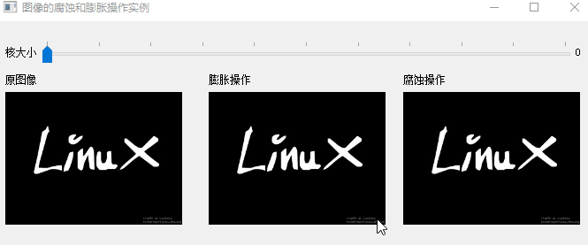

# 图像的腐蚀和膨胀操作
## 目标

* 应用两个非常常见的形态运算符：腐蚀和膨胀。为此，您将使用以下OpenCV函数：
  *  [cv::erode](https://docs.opencv.org/4.3.0/d4/d86/group__imgproc__filter.html#gaeb1e0c1033e3f6b891a25d0511362aeb)
  *  [cv::dilate](https://docs.opencv.org/4.3.0/d4/d86/group__imgproc__filter.html#ga4ff0f3318642c4f469d0e11f242f3b6c)

-------------------------------------------
Note
下面的说明来自Bradski和Kaehler的《 Learning OpenCV》一书。

-------------------------------------------

## 形态运算
* 简而言之：一组根据形状处理图像的操作。形态学运算将结构元素应用于输入图像并生成输出图像
* 最基本的形态学操作是：腐蚀和膨胀。它们具有多种用途，如：
  * 消除噪点
  * 隔离单个元素并在图像中加入不同的元素。
  * 查找图像中的强度凸起或孔洞
* 我们将以下图为例简要说明膨胀和腐蚀：

## 膨胀
* 此操作包括将图像A与某个核（B）卷积，核可以具有任何形状或大小，通常是正方形或圆形。
* 内核B具有定义的锚点，通常是内核的中心。
* 在对图像扫描内核B时，我们计算与B重叠的最大像素值，并用该最大值替换锚点位置中的图像像素。可以推断，这种最大化操作会导致图像中的明亮区域“增长”（因此称为膨胀）。
* 膨胀操作为:
* 以上面的图片为例。应用膨胀我们可以得到：
  

* 字母的明亮区域在背景的黑色区域周围膨胀。

## 腐蚀

* 这个操作和膨胀操作类似。它计算给定内核范围内的局部最小值。
* 在对图像扫描内核B时，我们计算与B重叠的最小像素值，并用该最小值替换锚点下的图像像素。
* 腐蚀操作为：
* 与膨胀示例类似，我们可以将腐蚀算子应用于原始图像（如上所示）。您可以在下面的结果中看到，图像的明亮区域变薄，而黑暗区域变大。

## 代码解释

参考代码，核心只有几行简单的命令,这里不做更多展开。

## 结果

