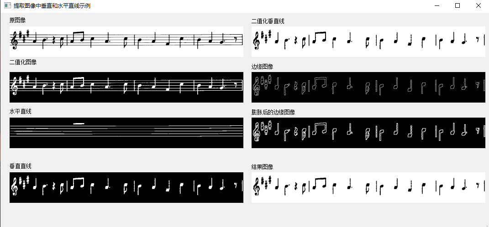

<!--
 * @Date: 2020-08-27 17:21:24
 * @LastEditTime: 2020-08-27 17:42:50
 * @Author:  Chang_Bin
 * @LastEditors: Chang_Bin
 * @Email: bin_chang@qq.com
 * @Description: In User Settings Edit
-->
# 通过形态学操作提取水平线和垂直线
## 目标
 * 应用两个非常常见的形态运算符（即“膨胀”和“侵蚀”），并创建自定义内核，以提取水平轴和垂直轴上的直线。为此，您将使用以下OpenCV函数：
   * [erode()](https://docs.opencv.org/4.3.0/d4/d86/group__imgproc__filter.html#gaeb1e0c1033e3f6b891a25d0511362aeb)
   * [dilate()](https://docs.opencv.org/4.3.0/d4/d86/group__imgproc__filter.html#ga4ff0f3318642c4f469d0e11f242f3b6c)
   * [getStructuringElement()](https://docs.opencv.org/4.3.0/d4/d86/group__imgproc__filter.html#gac342a1bb6eabf6f55c803b09268e36dc)

## 理论

### 形态学操作

形态学是一组图像处理操作，可基于预定义的结构元素（也称为内核）处理图像。输出图像中每个像素的值基于输入图像中相应像素与其相邻像素的比较。通过选择内核的大小和形状，可以构造对输入图像的特定形状敏感的形态运算。

最基本的两种形态学操作是扩张和侵蚀。膨胀将像素添加到图像中对象的边界，而侵蚀则恰好相反。添加或删除的像素数量分别取决于用于处理图像的结构元素的大小和形状。通常，这两个操作遵循的规则如下：

* **膨胀**：输出像素的值是落在结构元素的大小和形状内的所有像素的最大值。例如，在二进制图像中，如果输入图像的落入内核范围内的任何像素设置为值1，则输出图像的相应像素也将设置为1。后者适用于任何类型的图像（例如灰度，bgr等）。

<div align="center">

<div align="center">二进制图像上的膨胀操作</div>
</div>

<div align="center">

<div align="center">二灰度图像上的膨胀操作</div>
</div>

* **侵蚀**:膨胀操作反之亦然，适用于侵蚀操作。输出像素的值是所有落在结构元素尺寸和形状内的像素的最小值。查看下面的示例图：

<div align="center">

<div align="center">二值图像上的腐蚀操作</div>
</div>

<div align="center">

<div align="center">灰度图像上的腐蚀操作</div>
</div>

### 结构元素

从形态学操作中可以看出，用于探测输入图像的结构元素是最重要的部分。

结构元素是仅包含0和1的矩阵，可以具有任意形状和大小。通常，它们比要处理的图像小得多，而值为1的像素定义了邻域。结构元素的中心像素（称为原点）标识感兴趣的像素--即正在处理的像素。

例如，下面显示了7x7尺寸的菱形结构元素。

<div align="center">

<div align="center">菱形结构元素及其构造</div>
</div>

结构元素可以具有许多常见的形状，例如线条，菱形，圆盘，周期性线条以及圆形和大小。通常，您选择与要在输入图像中处理/提取的对象相同大小和形状的结构元素。例如，要在图像中查找线条，请创建一个线性结构元素，稍后将看到。

## 代码解释/结果

### 加载图像

```
src = cv::imread("../../opencv430ForQtBuild_win64/data/notes.png",
                   cv::IMREAD_COLOR);
  if (src.empty()) {
    ui->lbl_srcImg->setText("加载图片失败");
    return;
  }
```

### 灰度化

```
  if (src.channels() == 3) {
    cv::cvtColor(src, src, cv::COLOR_BGR2GRAY);
  }
```

### 灰度图转换为二值化图

```
//在灰色的bitwise_not处应用adaptiveThreshold，注意〜符号
  cv::Mat bw;
  cv::adaptiveThreshold(~src, bw, 255, cv::ADAPTIVE_THRESH_MEAN_C,
                        cv::THRESH_BINARY, 15, -2);
  dispalyImage(ui->lbl_bitwiseImg, bw);
```

### 输出图像

现在，我们准备应用形态学操作来提取水平和垂直线，从而从音乐表中分离出音符，但是首先让我们初始化输出图像，因为这个原因：
```
  //创建将用于提取水平线和垂直线的图像
  cv::Mat horizontal = bw.clone();
  cv::Mat vertical = bw.clone();
```

### 结构元素
正如我们在理论中指定的那样，为了提取所需的对象，我们需要创建相应的结构元素。由于我们要提取水平线，因此用于此目的的相应结构元素将具有以下形状：

<div align="center">

</div>

```
//在水平轴上指定尺寸
  int horizontalSize = horizontal.cols / 30;
  //创建用于通过形态学操作提取水平线的结构元素
  cv::Mat horizontalStructure =
      cv::getStructuringElement(cv::MORPH_RECT, cv::Size(horizontalSize, 1));
  //应用形态学运算
  cv::erode(horizontal, horizontal, horizontalStructure, cv::Point(-1, -1));
  cv::dilate(horizontal, horizontal, horizontalStructure, cv::Point(-1, -1));
  //显示提取到的水平线
  dispalyImage(ui->lbl_hLinesImg, horizontal);
```

提取垂直线也是如此，具有相应的结构元素：

<div align="center">

</div>

```
//在垂直轴上指定尺寸
  int verticalSize = vertical.rows / 30;
  //创建用于通过形态学操作提取垂直线的结构元素
  cv::Mat verticalStructure =
      cv::getStructuringElement(cv::MORPH_RECT, cv::Size(1, verticalSize));
  //应用形态学运算
  cv::erode(vertical, vertical, verticalStructure, cv::Point(-1, -1));
  cv::dilate(vertical, vertical, verticalStructure, cv::Point(-1, -1));
  //显示提取到的垂直线
  dispalyImage(ui->lbl_vLinesImg, vertical);
```

### 优化边缘/结果

此时您会注意到音符的边缘有些粗糙。出于这个原因，我们需要优化边缘以获得更平滑的结果：

```
  //----------------------根据逻辑提取边缘和平滑图像--------------------------------
  // Step1 提取边缘
  cv::Mat edges;
  cv::adaptiveThreshold(vertical, edges, 255, cv::ADAPTIVE_THRESH_MEAN_C,
                        cv::THRESH_BINARY, 3, -2);
  dispalyImage(ui->lbl_edgesImg, edges);
  // step2 膨胀边界
  cv::Mat kernel = cv::Mat::ones(2, 2, CV_8UC1);
  cv::dilate(edges, edges, kernel);
  dispalyImage(ui->lbl_dilateEdgesImg, edges);
  // Step3  src.copyTo(smooth)
  cv::Mat smooth;
  vertical.copyTo(smooth);
  // Step4 滤波
  cv::blur(smooth, smooth, cv::Size(2, 2));
  // Step5 smooth.copyTo(src, edges)
  smooth.copyTo(vertical, edges);
  //展示最终结果
  dispalyImage(ui->lbl_resultImg, vertical);
  //-------------------------------------------------------------------
```

<div align="center">

</div>