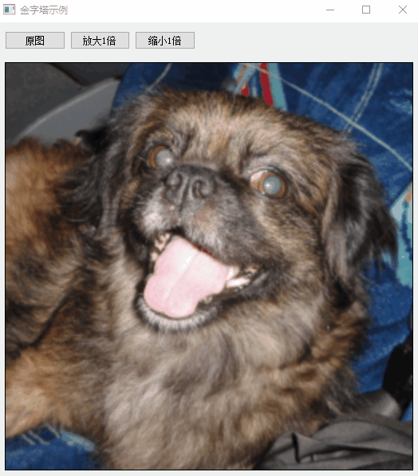

<!--
 * @Date: 2020-08-28 21:14:45
 * @LastEditTime: 2020-08-28 21:42:47
 * @Author:  Chang_Bin
 * @LastEditors: Chang_Bin
 * @Email: bin_chang@qq.com
 * @Description: In User Settings Edit
-->
# 图像金字塔操作

## 目标

* 使用OpenCV函数[pyrUp()](https://docs.opencv.org/4.3.0/d4/d86/group__imgproc__filter.html#gada75b59bdaaca411ed6fee10085eb784)对给定图像进行下采样
* 使用OpenCV函数[pyrDown()](https://docs.opencv.org/4.3.0/d4/d86/group__imgproc__filter.html#gaf9bba239dfca11654cb7f50f889fc2ff)对给定图像进行上采样

## 理论

----------------------------------------

Note

下面的解释来自Bradski和Kaehler的《学习OpenCV》一书。

* 通常我们需要将图像转换为与原始图像不同的大小。为此，有两种可能的选择

  1. 放大图像（放大）
  2. 缩小图像(缩小)

* 虽然OpenCV中有一个几何变换函数，可以按字面意思调整图像的大小（resize，我们将在以后的教程中介绍），但在本节中，我们首先分析图像金字塔的使用，它广泛应用于各种视觉应用程序中。

-------------------------------------------

## 图象金字塔

* 图像金字塔是图像的集合-所有图像均来自单个原始图像-图像被连续下采样直到达到某个所需的停止点。
* 有两种常见的图像金字塔:
  * 高斯金字塔：用于对图像进行下采样
  * 拉普拉斯金字塔：用于从金字塔较低的图像中重建上采样的图像（分辨率较低）
* 在本教程中，我们将使用高斯金字塔

## 高斯金字塔

* 将金字塔想象成一组图层，其中图层越高，尺寸越小。

* 每层都从下到上编号，因此第层（表示为）小于第层（）。
* 为了在高斯金字塔中产生层，我们执行以下操作：
  1. 将与高斯核卷积：

<a href="https://www.codecogs.com/eqnedit.php?latex=\frac{1}{16}&space;\begin{bmatrix}&space;1&space;&&space;4&space;&&space;6&space;&&space;4&space;&&space;1&space;\\&space;4&space;&&space;16&space;&&space;24&space;&&space;16&space;&&space;4&space;\\&space;6&space;&&space;24&space;&&space;36&space;&&space;24&space;&&space;6&space;\\&space;4&space;&&space;16&space;&&space;24&space;&&space;16&space;&&space;4&space;\\&space;1&space;&&space;4&space;&&space;6&space;&&space;4&space;&&space;1&space;\end{bmatrix}" target="_blank"></a>

  2. 删除所有偶数行和列。

* 结果图像的面积将正好是其前一个图像的四分之一。在输入图像（原始图像）上迭代此过程将生成整个金字塔

* 上面的步骤对图像下采样很有用。如果要增大它会怎样？：用0填充列
  * 首先，将图像放大为每个维度的两倍，并添加新的偶数行
  * 使用上面显示的相同内核（乘以4）进行卷积，以近似“丢失像素”的值
* 这两个过程（如上所述的降采样和上采样）由OpenCV函数pyrUp（）和pyrDown（）实现

------------------------------------------------

Note

当我们减小图像尺寸时，实际上是在丢失图像信息。

------------------------------------------------

## 代码说明

见[代码](./mainwindow.cpp)

## 结果

