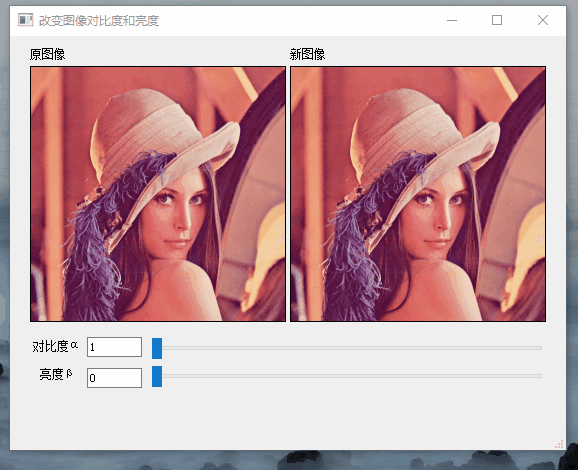

# 更改图像的对比度和亮度
## 目标
在本教程中，您将学习如何：

* 访问像素值;
* 用零初始化矩阵
* 了解[cv::saturate_cast](https://docs.opencv.org/4.3.0/db/de0/group__core__utils.html#gab93126370b85fda2c8bfaf8c811faeaf)的功能及其有用之处；
* 获得有关像素变换的一些有意思的信息;
* 在实际示例中提高图像的亮度；
* 简单使用QSlider组件；

## 理论
* Note:

    以下说明属于Richard Szeliski撰写的[《计算机视觉：算法和应用》](http://szeliski.org/Book/)一书
### 图像处理
* 通用图像处理操作:获取一个或多个输入图像并生成一个输出图像。
* 图像变换可以看成是：
  * 点运算（像素变换）
  * 邻域（基于区域）的运算
### 像素变换

* 在这种图像处理转换中，每个输出像素的值仅取决于相应的输入像素值（可能加上一些全局收集的信息或参数）。
* 这样的操作的例子包括亮度和对比度调整以及颜色校正和变换。
### 亮度和对比度调整
* 两个常用的点运算是具有常数项的乘法和加法：
  <div align="center">
  
  </div>
* 参数α> 0和β通常被称为增益和偏置参数。这些参数分别控制对比度和亮度。
* 您可以将f(x)视为源图像像素，将g(x)视为输出图像像素。然后，我们可以更方便地将表达式编写为：

<div align="center">

</div>
其中，i和j表示像素位于第i行和第j列。

## 代码说明

* 我们使用[cv::imread](https://docs.opencv.org/4.3.0/d4/da8/group__imgcodecs.html#ga288b8b3da0892bd651fce07b3bbd3a56)加载图像并将其保存在Mat对象中：

```
  srcImg = cv::imread("../../opencv430ForQtBuild_win64/data/lena.jpg",
                      cv::IMREAD_COLOR);
  if (srcImg.empty()) {
    ui->label_srcImg->setText("加载图片失败");
    ui->label_srcImg->setStyleSheet("color:#F46A4E");
    return;
  }
```
* 仍然使用QLabel组件来显示图像：
  ```
   //重设图片大小
  dsize = cv::Size(ui->label_srcImg->width(), ui->label_srcImg->height());
  cv::Mat tempSrcImg;
  cv::resize(srcImg, tempSrcImg, dsize);
  //注意:此处使用了QImage::Format_BGR888而不是QImage::Format_RGB888
  QImage srcImage =
      QImage((const uchar *)tempSrcImg.data, tempSrcImg.cols, tempSrcImg.rows,
             tempSrcImg.step, QImage::Format_BGR888);
  ui->label_srcImg->setPixmap(QPixmap::fromImage(srcImage));
  ui->label_dstImg->setPixmap(QPixmap::fromImage(srcImage));
  ```
* 由于我们将对该图像进行一些转换，因此我们需要一个新的Mat对象来存储变换后的图像。另外，我们希望它具有以下功能：
  * 初始像素值等于零;
  * 与原始图像大小和类型相同
  ```
  dstImg = cv::Mat::zeros(srcImg.size(), srcImg.type());
  ```
  [cv::Mat::zeros](https://docs.opencv.org/4.3.0/d3/d63/classcv_1_1Mat.html#a0b57b6a326c8876d944d188a46e0f556)的参数为image.size()和image.type(),返回值为Matlab样式的零初始值矩阵;

* 现在，我们使用QSlider的移动获得α和β的值，这里主要用到了QSlider的sliderMoved(int)槽函数：
  ```
  void MainWindow::on_hSlider_contrast_sliderMoved(int position) {
  alpha = position / 10.0; //由于QSlider步长只能为整数，所以对数值进行缩放
  ui->lineEdit_contrast->setText(QString::number(alpha, 'f', 1));
    }
  ```
  ```
  void MainWindow::on_hSlider_brightness_sliderMoved(int position) {
  beta = position;
  ui->lineEdit_brightness->setText(QString::number(beta));
  }
  ```
* 为了实现，我们会访问图像中的每个像素。由于我们正在处理BGR图像，因此每个像素有三个值（B，G和R），因此我们也将分别访问它们。这是一段代码：
```
  for (int y = 0; y < srcImg.rows; y++) {           //遍历每一行
    for (int x = 0; x < srcImg.cols; x++) {         //遍历每一列
      for (int c = 0; c < srcImg.channels(); c++) { //遍历每一个通道
        dstImg.at<cv::Vec3b>(y, x)[c] = cv::saturate_cast<uchar>(
            alpha * srcImg.at<cv::Vec3b>(y, x)[c] + beta);
      }
    }
  }
```
* 请注意（仅C ++代码）：

  *  要访问图像中的每个像素，我们使用以下语法：image.at <Vec3b>（y，x）[c]其中y是行，x是列，c是B，G或R（0、1或2）。 
  *  由于通过可以计算出出超出范围的值或非整数（如果α为浮点数），因此我们使用[cv::saturate_cast]([)](https://docs.opencv.org/4.3.0/db/de0/group__core__utils.html#gab93126370b85fda2c8bfaf8c811faeaf)来确保值有效。
  *  可以使用更简单的方法代替使用for循环访问每个像素:
        ```
        image.convertTo(new_image, -1, alpha, beta);
        ```
        其中[cv::Mat::convertTo](https://docs.opencv.org/4.3.0/d3/d63/classcv_1_1Mat.html#adf88c60c5b4980e05bb556080916978b)将有效地执行* new_image = a * image + beta *。但是，我们想向您展示如何访问每个像素。无论如何，这两种方法都可以得到相同的结果，但是convertTo更加优化并且工作更快。
## 结果

<div align="center">

</div>

## 实际例子

在本节中，我们将通过将所学的调整图像的亮度和对比度的知识用于校正曝光不足的图像。我们还将看到另一种用于校正图像亮度的技术，称为伽马校正。

### 亮度和对比度调整
增加（/减少）β值将为每个像素增加（/减去）一个常数。超出[0;255]范围内的像素值会出现饱和现象。即，高于（/小于）255（/ 0）的像素值将被钳位到255（/ 0）。

<div align="center">

<div align=center>在Gimp中，当亮度= 80时，原始图像的灰色和黑色直方图</div>
</div>


直方图代表每种颜色等级的像素数。深色图像将具有许多具有较低色值的像素，因此直方图将在其左侧出现一个峰值。当添加恒定偏置时，直方图会向右移动，因为我们已向所有像素添加了恒定偏置。

α参数将修改偏置程度。如果α<1，则将压缩色阶，结果是对比度较低的图像。

<div align="center">

<div align=center>当对比度＜0时，原始图像的灰色和黑色直方图</div>
</div>

请注意，这些直方图是使用Gimp软件中的“亮度对比”工具获得的。亮度工具应与偏置参数β相同，但对比度工具似乎与增益α不同，后者的输出范围似乎以Gimp居中（如您在前面的直方图中所注意到的）。

可能会发生这样的情况：以偏置β播放会提高亮度，但与此同时，由于对比度会降低，因此图像看起来会带有轻微的朦胧感。可以使用增益α来减小这种影响，但是由于饱和，我们将在原始明亮区域中丢失一些细节。

### 伽玛校正

[伽玛校正](https://en.wikipedia.org/wiki/Gamma_correction)可通过在输入值和映射的输出值之间进行非线性变换来校正图像的亮度：
<div align="center">

</div>
由于此关系是非线性的，因此效果对于所有像素都不相同，并且取决于像素原始值。
<div align="center">

<div align=center>不同伽玛值下的曲线</div>
</div>

当γ<1时，原始的暗区域将变亮，直方图将向右移动，而当γ> 1时则相反。

### 校正曝光不足的图像
下图校正参数为：α= 1.3，β= 40。
<div align="center">

</div>
整体亮度已得到改善，但是您会注意到由于所使用的方法导致数值饱和（摄影中成为高光裁剪），云现在已大大饱和。

下图校正参数为：γ= 0.4。

<div align="center">

</div>

伽玛校正应倾向于增加较少的饱和度效果，因为映射是非线性的，并且不可能像以前的方法那样出现数值饱和度。

<div align="center">

<div align=center>左：alpha，beta校正后的直方图；中心：原始图像的直方图；右：伽玛校正后的直方图</div>
</div>

上图比较了三个图像的直方图（三个直方图之间的y范围不同）。您会注意到，大多数像素值位于原始图像的直方图的下部。经过α，β校正后，由于饱和度以及右移，我们可以在255处观察到一个大的峰值。经过伽玛校正后，直方图向右移动，但是暗区域中的像素比亮区域中的像素移动更多（请参见伽马曲线图）。

在本教程中，您已经看到了两种简单的方法来调整图像的对比度和亮度。**它们是基本技术方法，不能替代光栅图形编辑器！（PS：不能替代P图软件）**

### 代码
gamma校正的代码可以自己尝试写出来，这里只给出官网的代码
```
    Mat lookUpTable(1, 256, CV_8U);
    uchar* p = lookUpTable.ptr();
    for( int i = 0; i < 256; ++i)
        p[i] = saturate_cast<uchar>(pow(i / 255.0, gamma_) * 255.0);
    Mat res = img.clone();
    LUT(img, lookUpTable, res);
```
查找表用于提高计算性能，因为只需要计算一次256个值。

### 附加资源
* [图形渲染中的伽玛校正](https://learnopengl.com/#!Advanced-Lighting/Gamma-Correction)
* [伽玛校正和CRT显示器上显示的图像](http://www.graphics.cornell.edu/~westin/gamma/gamma.html)
* [数字曝光技术](http://www.cambridgeincolour.com/tutorials/digital-exposure-techniques.htm)